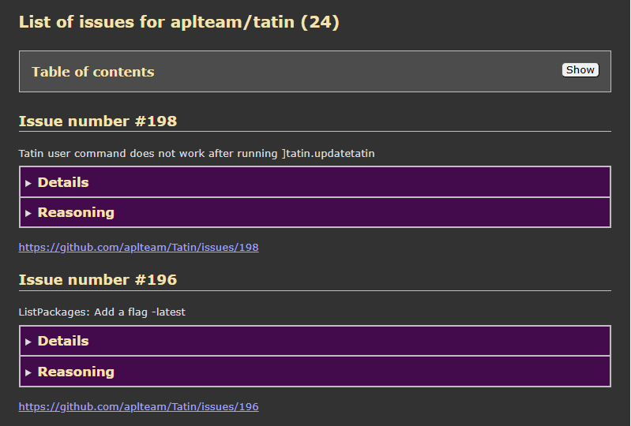

# GitHub

## Overview

`GitHub` offers user commands that use the `GitHubAPIv3` package to communicate with GitHub.

`GitHub` does not have an API: in the event that you want to execute a command under program control check `GitHubAPIv3`'s API: for all user commands there are functions available in the `GitHubAPIv3` package. 

The purpose of the user commands offered via `]GitHub` is to get a better overview than is available on GitHub itself.

## Examples

### List repositories

Get a list of all repositories for the owner "aplteam":

```
      ]GitHub.ListRepos aplteam
 Name (68)                 
 ---------                 
 ADOC                      
 APLGit2                   
 APLProcess                
 APLTreeUtils2             
 Cider                     
 CodeBrowser               
 CodeCoverage              
 CommTools                 
 Compare                   
 CompareFiles              
 ...
 ZipArchive                
```

With `-verbose` you can ask for more details:

```
      ]ListRepos -verbose
 Name                       OI (*)  Description
 ----                       ------  -----------
 ADOC                            2  Automated documentation generation for Dyalog APL
 apl-cation                         Homepage for all members of the APL-Cation project
 APLGit                             Implements an interface to the GitBash from the session
 APLGit2                         3  Interface between Git and Dyalog APL
 APLProcess                      1  Start an APLProcess from within APL
 ...
```

Note that "OI" stands for "open issues.

If you want to get a detailed list of all repos that have at least one issue, sorted by the number of open issues:

```
      ]ListRepos -v -issues -sort=issues
 Name           OI (*)  Description
 ----           ------  -----------
 Tatin              29  Tatin is a package manager for Dyalog APL
 Cider              22  Cider is a Project Manager for Dyalog APL
 CodeBrowser         8  Browse through APL code
 CodeCoverage        6  Collects data on code coverage & creates an HTML report on the data
 Launchy             4  Gui for running selected versions of Dyalog APL with specific parameters
 APLGit2             3  Interface between Git and Dyalog APL
 ...
```

### List issues

Get a list with all issues for the project "aplteam/tatin":

```
      ]GitHub.ListIssues aplteam tatin
 No.  Title
 ---  -----
 198  Tatin user command does not work after running ]tatin.updatetatin
 196  ListPackages: Add a flag -latest
 192  Consider switching from ZIP to TAR
 190  ]UpdateTatin should allow to update to a specific version
 ...
  70  Add sorting to the columns of tables
```

Get a detailed list with all issues for the project "aplteam/tatin":

```
      ]GitHub.ListIssues aplteam tatin -verbose
 No.  Title                      Label(s)    Creator   Created at  ≢⍝  Assignee
 ---  -----                      --------    -------   ----------  --  --------
 198  Tatin user command ...                 dyavc     2024-07-30   2
 196  ListPackages: Add  ...  enhancement    aplteam   2024-07-03
 192  Consider switching ...  enhancement    aplteam   2024-06-05   1
 190  ]UpdateTatin should ... enhancement    aplteam   2024-03-26   1
 ...
  70  Add sorting to the ...  enhancement     aplteam   2021-11-01
```

Create a full-blown HTML report on all issues for a project:

```
]GitHub.ListIssues aplteam tatin -html -collapse -filename="/path/2/Issues.html"
```
This statement creates 

### Access tokens

All the `]GitHub` user commands are doing is to read public data, so you don't need to worry about authentication, right?! Unfortunately that is not true.

Without authentication, one has only a limited number of tokens available for a day, and when you access GitHub a lot, you might well use them all up.

However, authentication is easy: you need an access token. Once you have that, you can pass it in one of two ways:

#### Config file 

In your home directory, there is a folder `.config` which hosts, possibly among other stuff, a folder `github`, and in that folder, there is a file `github-config.json5`. Add this:

```
{
  owner: "aplteam",
  access_token: "whatever-your-token-is",
}
```

If the file does not exist yet, create it.

Of course this might not be save to do, depending on your circumstances,

#### Environment variable

You might set a variable `GITHUB_ACCESS_TOKEN` so that it holds your access token, and it will be picked up. 

This is considerd to be a saver option.


